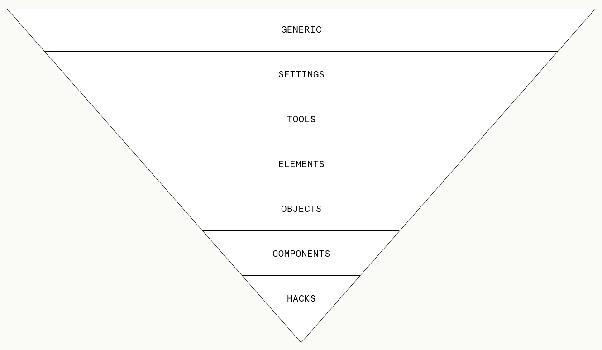

# CSS Guide
We follow these guidelines to ensure that every engineer produces quality code, consistently.

* [Browser and Device Support](#browser-and-device-support)
* [CSS Architecture](#css-architecture)
* [CSS Style Guide](#css-style-guide)
* [CSS Lint Configuration] - Coming Soon

## Browser and Device Support
Some projects have specific support requirements but generally, this is what we recommend.

### BROWSER SUPPORT
**MacOS**
- The two most recent releases of Chrome, Firefox, and Safari.

**Windows**
- The latest versions of Chrome and Firefox
- IE 10 and newer
- Windows 8 and newer

### DEVICE SUPPORT

**iOS**
- All mobile, tablet, laptop and desktop devices >= 320px (iPhone 5 and newer).

**Android**
- All mobile, tablet, laptop and desktop devices >= 320px wide.


## CSS Architecture
Our approach to CSS Architecture is a combination of best practices, personal preferences, advice from [Harry Roberts](https://www.creativebloq.com/web-design/manage-large-css-projects-itcss-101517528). 

Imagine your CSS as an inverted triangle. Write the most generic rules up front. As the style sheet progresses, your code should be more specific and, effecting less and less of the DOM.

1. Generic - CSS reset
2. Settings - Variables
3. Tools - Mixins and functions
4. Elements - HTML element selectors
5. Objects - Non-cosmetic design patterns
6. Components - Recognizable pieces of the UI (most of your work happens here)
7. Hacks - Inelegant, heavy-handed techniques to override other styles




## CSS Style Guide

We practice the [principles of OOCSS](http://www.smashingmagazine.com/2011/12/an-introduction-to-object-oriented-css-oocss/) wherever possible.


### BRACKETS
Place the opening curly-bracket of each rule block on the same line as the last selector. Place the closing curly-bracket of each rule block on its own line after the final property of the rule block. End each property with a semicolon.
```scss
.selector {
  height: 100vh;
  padding: 1em;
}
```

### BROWSER HACKS
Browser hacks should only be used on browsers <= IE10. Blink only supports browsers >= IE11 on platforms >= Windows 8. This decision was made because as of January 12, 2016, Microsoft stopped supporting IE10 and older. At this point, Chrome, FF, Safari, Edge, and IE11+ are W3C standards compliant on both Mac and PC. This means any browser inconsistencies with your code should be solvable without resorting to browser hacks. Of course nothing is perfect, so if you find yourself in a bind, feel free to use browser hacks, but make it a point to come back later and try to fix it without hacking.

**Resources**
* http://browserhacks.com

With legacy applications, it's preferable to use conditional comments over browser hacks if you have a large amount of code targeted at a specific browser.
```html
<!--[if IE 9]><link href="ie9.css" rel="stylesheet" /><![endif]-->
<!--[if lte IE 8]><link href="ie8.css" rel="stylesheet" /><![endif]-->
<!--[if lte IE 7]><link href="ie7.css" rel="stylesheet" /><![endif]-->
<!--[if lte IE 6]><link href="ie6.css" rel="stylesheet" /><![endif]-->
```

### CAPITALIZATION
Do not use capitalization, all classes and ids should be lowercase and delimited as [documented below](#name-delimiters).

### CLASSES AND IDS
Do not use `id` for styling purposes

Acceptable uses for `id` include:

- JavaScript selection - prefix these with js- to indicate they are for JavaScript only
- Assigning form labels to inputs
- Jump links between sections of a page

```html
<section class="jumbotron" id="js-jumbotron"> ... </section>
```
```html
<label for="first-name">First Name</label>
<input id="first-name" type="text">
```
```html
<a href="#about">Skip to About section</a>

---

<section id="about"> ... </section>
```

### COMMENTS AND GROUPING
Group related rule blocks by base object using the standardized section comment style.
```scss
/* block: nav */
.b-nav {
  background-color: #fff;
  display: flex;
}
```
If a section requires additional subsets of comments, a single line comment is acceptable.

If a property / value pair needs additional clarity or is not self-documenting, add comments on the same line immediately following the value.
```scss
/* block: b-nav */
.b-nav {
  background-color: #fff;
  display: flex; /* will not work in <IE10 */
}
/* resize the logo for retina screens and adjust it's padding accordingly */ 
.nav__logo {
  background: transparent url("logo.png") 0 0 no-repeat;
  background-size: 50%;
  padding: 0 .5em;
}
```

### ENCODING
Do not include a `@charset` in the CSS.
```scss
/* DO NOT */
@charset "UTF-8";

.selector {
  color: #fff;
}
```

### FOLDER STRUCTURE (SCSS)
Our Sass files are organized into a number of subfolders with specific purposes. There are some differences depending on if the project is built using a JS framework like react / angular noted below.

``` sass
reset/         // includes css reset
includes/      // includes variables, extends & mixins. *1
typography/    // includes site-wide typography styles
layout/        // includes global layout styles
components/    // includes standalone, modular components. *2
theme/         // includes themeing styles
elements/      // includes styled elements... ie. buttons, form fields ...etc.

*1: None of the scss in the includes folder will compile to css. Only $variables, @mixins, & @extends are allowed. This file will be directly important into React / Angular components and should not add duplicate css rules.

*2: The components folder will be ommitted for projects built using js frameworks like react / angular. Individual components will instead import their scss directly.
```
See details about file names [here](#naming).


### HEXADECIMAL NOTATION
Always use six character and UPPERCASE hexadecimal notation, this includes inside Sass variables. If the hexcode's 6 characters are identical, it's ok to shorthand the hexcode to 3 characters.

We use uppercase notation because that is how the values are copy/pasted from Sketch.

```scss
.selector-one {
  color: #F5F5F5;
}
.selector-two {
 color: #555; /* the same as #555555 */
}
```

### INDENTATION
Use 2 spaces for indenting. Do it.
```scss
.selector {
  height: 100vh;
  padding: 1em;
}
```

### MULTI-VALUE PROPERTIES
Format multi-value properties by starting a new line for each value and indenting each line 2 spaces.
```sass
.selector {
  background: 
    transparent url("main-background.jpg") 0 0/cover no-repeat;
    transparent url("overlay-background.png") 50% 25% no-repeat; 
}
```

### MULTIPLE SELECTORS
Separate multiple selectors in the same rule block with a comma and place each selector on a new line.
```scss
.selector:hover,
.selector:focus {
  color: #555;
}
```

### NAMING

**Class Names**

Use BEM for class names.

```scss
.block {
  padding: 0;
}
.block__element {
  padding: 0;
}
.block__element--modifier {
  padding: 0;
}
```

**Resources**
* https://css-tricks.com/bem-101
* https://csswizardry.com/2013/01/mindbemding-getting-your-head-round-bem-syntax
* https://www.sitepoint.com/bem-smacss-advice-from-developers


**File Names**

All files within each folder are prefixed with the folder name.
``` css
includes/
  _includes.index.scss
  _includes.variables.scss
  _includes.colors.scss
  _includes.mixins.scss
  _includes.typography.scss
  _includes.icons.scss
```

**States**

Use the class prefix `.is-` as in `.is-active` `.is-hidden` `.is-open`. To style, tie it to a class using a Sass `&`
```sass
.selector {
  &.is-open {
    display: block;
  }
}
```
### NESTING

Avoid excessive nesting. As a rule of thumb, elements should not be nested unless necessary. If a rule requires more than three levels of nesting, reconsider your architecture.

### PROPERTY ORDER
CSS properties can be grouped alphabetically for easing scanning and locating.
```scss
.selector {
  @include mixin();        // includes go at the top of the rule
  @extend .extend;         // followed by extends
  align-items: center;
  background-color: #eee;
  display: flex;
  flex-flow: column wrap;
  height: 100vh;
  margin: 0 1em;
  opacity: 1;
  overflow: hidden;
  padding: 1em;
  visibility: visible;
  transition: all .2s;
  /* when media queries are used, they must go at the end of the rule, 
   * but before any nested rules. Media queries are prefixed with a single 
   * line comment in all lowercase that reads 'media queries'. */
  // media queries
  @include breakpoint(48em) {
    font-size: 1rem;
  }

  .nested-rule {
    // @includes
    // @extends
    // properties
    // media queries
  } 
}
```

### BREAKPOINT MIXIN
We use a breakpoint mixin in order to simplify and consolidate the writing of media queries.

```scss
// media query mixins
@mixin breakpoint($value, $type: max-width) {
  @media only screen and ($type: $value) {
    @content
  }
}
```

The mixin uses max-width based media queries by default but can be overridden by including a 2nd parameter. The mixin should be modified for mobile first projects to use min-width by default.

### BREAKPOINTS
We use the following breakpoint variables. We have found that these are broad enough to cover most use cases and common device sizes. Each breakpoint starts at a pixel width slightly higher than the device they are targeting. For example: use $tablet-lg (1040px) to target tablets in landscape mode (1024px).

```scss
// breakpoint variables
$desktop-lg: 1400px;
$desktop-md: 1300px;
$desktop-sm: 1200px;
$tablet-lg: 1040px;
$tablet-md: 991px;
$tablet-sm: 840px;
$mobile-lg: 767px;
$mobile-md: 540px;
$mobile-sm: 400px;
$mobile-xsm: 350px;
```


### MEDIA QUERIES
Each css selector should have its own media query. Avoid nesting selectors inside media queries.
```scss

// Do this
.selector {
  color: white;
  // media queries
  @include breakpoint($mobile-lg) {
    color: pink;
  }

  p {
    border: 1px solid white;
    // media queries
    @include breakpoint($mobile-lg) {
      border-color: pink;
    }
  }
}

// Don't do this
.selector {
  color: white;
  // media queries
  @include breakpoint($mobile-lg) {
    color: pink;

    p {
      border-color: pink;
    }
  }

  p {
    border: 1px solid white;
  }
}
```

### PROPERTY WHITESPACE
Put each property on its own line. Follow each property with a semicolon.
```scss
.selector {
  height: 100vh;
  padding: 1em;
}
```

### RULE BLOCK SEPARATION
Separate each rule block with an empty line.
```scss
.selector-one {
  height: 100vh;
  padding: 1em;
}

.selector-two {
  display: flex;
  margin: 1em;
}
```

### SELECTOR SPECIFICITY
Keep selector [specificity](https://www.smashingmagazine.com/2007/07/css-specificity-things-you-should-know/) as low as possible, opting for a single class as the best selector.
```sass
/* Do this */
.article__header--large {
  font-size: 4em;
  line-height: 1.6;
}

/* Don't do this */
.article {
  .header {
    .large {
      font-size: 4em;
      line-height: 1.6;
    }
  }
}

/* Don't overquality selectors if not needed, it increases specificity. In the example below, the ul is not needed. */
ul.list {
  list-style: none;
}
```

### SEMICOLONS
Follow each property value (even the last one) with a semicolon. Though it isn't technically necessary to include the semicolon on the last line, it is important to be consistent in case you return to add more rules to the selector.

```scss
.selector {
  height: 100vh;
  padding: 1em;
}
```

### SHORTHAND
Use shorthand where possible unless setting a single value. Check out the handy reference guide with all the CSS properties that utilize shorthand below. 

**Resources**
* https://www.w3.org/community/webed/wiki/CSS_shorthand_reference

### SINGLE PROPERTIES
It's ok to put rule blocks with a single property on a single line. Include a space after the opening bracket and before the closing bracket.
```scss
.selector { height: 100vh; }
```

### TABLE OF CONTENTS
Ain't nobody got time or use for this. Don't bother adding a table of contents in the CSS please.

### TODO COMMENTS
Mark todos and action items with a comment that includes `TODO`. Be sure that `TODO` is always uppercase.
```scss
/* TODO - refactor this into a shorthand property */
.selector {
  color: #fff;
  font-family: "lato", Helvetica, sans-serif;
  font-size: 1.2em;
  font-weight: 500;
  line-height: 1.4;
}
```

### TRAILING WHITESPACE
Remove all trailing whitespace, except for a single empty line at the end of each file.

### VENDOR PREFIXES
Ain't nobody got time for that. Integrate an autoprofixer into your build process.

### W3C VALIDATION
* Write valid code.
* Remaining errors and warnings should be intentional.

**Resources**
* http://jigsaw.w3.org/css-validator
* http://csslint.net
